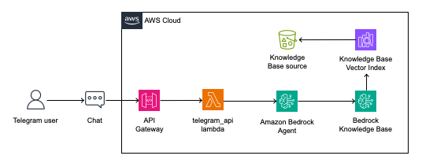

# Introduction

This repo implements a CDK stack that leverages CDK 
[L1](https://docs.aws.amazon.com/cdk/api/v2/docs/aws-cdk-lib.aws_bedrock.CfnAgent.html) 
[constructs](https://docs.aws.amazon.com/cdk/api/v2/docs/aws-cdk-lib.aws_bedrock.CfnKnowledgeBase.html) 
to create a Telegram Bot for handling GenAI-powered interactions with a hotel guest.

The code implements a Telegram bot that leverages [Webhooks](https://core.telegram.org/bots/api#setwebhook)
for compatibility with other messaging platforms to assist hotel customers with information regarding their stay
in a hotel.

The code is also a good example of how to create a Bedrock Agent completely with CDK that you can use as a
base for other implementations. 

# Architecture

The solution relies on two main components:
* An Amazon Bedrock agent powered by Anthropic Claude Haiku + Cohere Embed Multilingual for handling
  the conversations.
* An [API Gateway](https://aws.amazon.com/api-gateway/) powered by the lambda code defined in
  [`telegram_api`](lambda/telegram_api) & [`whatsapp_api`](lambda/whatsapp_api) that handles Telegram & WhatsApp Webhook requests and, 
  using the Bedrock Agent, answers the user's requests.

The diagram below describes the current architecture of the solution.



# Requirements

* Python 3.12
* [CDK](https://docs.aws.amazon.com/cdk/v2/guide/getting_started.html)
* [Docker](https://www.docker.com/) or [Podman](https://podman.io/) for compiling the container images
* The requirements in [`requirements.txt`](requirements.txt) and in each individual lambda code folder.
* [A new Telegram bot](https://core.telegram.org/bots/tutorial); note its API key as provided by Botfather.
* [A WhatsApp app](https://developers.facebook.com/docs/whatsapp/cloud-api/get-started); note its API key & Phone ID in WhatsApp > API Setup from the 
  app page in the Facebook developer portal.

# Setup

Make sure to deploy the stack in an AWS region where Amazon Bedrock with Anthropic Claude 3 Haiku & 
Cohere Embed Multilingual and Bedrock Agents are available.

In the root folder of this repo, run:

```bash
# Only run the following if running in Podman, skip it if you're using Docker
export CDK_DOCKER=podman
# Deploy providing the API key you got when creating the new Telegram & WhatsApp bots
cdk deploy --parameters TelegramAPIKey="${TELEGRAM_API_KEY}" --parameters WhatsaAppAPIKey="${WHATSAPP_API_KEY}" --parameters WhatsaAppPhoneID="{WHATSAPP_ID}"
# You can now optionally get the WhatsAppAPIVerifyToken value as follows
aws secretsmanager get-secret-value --secret-id WhatsAppAPIVerifyToken --query SecretString
```

The telegram bot should now be working, you will have to manually configure the 
[WhatsApp webhook](https://developers.facebook.com/docs/whatsapp/cloud-api/guides/set-up-webhooks).

Go to your application in the Facebook developer portal and in the left menu go to WhatsApp > Configuration;
use the value of `HotelAssistant.GenAIAssistantMessagingAPIEndpoint` from the CDK deployment `Outputs` section
and from the `WhatsAppAPIVerifyToken` secret in AWS Secrets Manager and use them for configuring the WhatsApp
Webhook as shown in the following image.


After that, the WhatsApp should now be working. You can start a discussion as described [below](#whatsapp).


# Code structure

The code in this project is organized as follows:

* [`cdk`](cdk): CDK python code for deploying the infrastructure.
  - [`hotel_assistant.py`](cdk/hotel_assistant.py): Main CDK Stack code
  - [`hotel_aoss_kb_stack.py`](cdk/hotel_aoss_kb_stack.py): An opinionated, easy-to-use, CDK construct that creates
    the OpenSearch Serverless Collection, S3 deployment, Bedrock Agent & Bedrock knowledge base, all using native
    CDK L1 constructs. The OpenSearch Serverless Collection Index is, however, created as a Custom resource in this
    stack with the code in the [`collections`](lambda/collections) lambda, since it cannot be created with CDK today.
  - [`messaging_backend.py`](cdk/messaging_backend.py): CDK construct for deploying the API gateway with Lambda
    integration for implementing the telegram webhook backend.
* [`docs`](docs): Folder with documents that will be deployed to S3 when deploying the stack components in
  [`hotel_aoss_kb_stack.py`](cdk/hotel_aoss_kb_stack.py).
* [`lambda`](lambda): Lambda code. All lambdas are implemented in python with container runtimes.
  - [`collections`](lambda/collections): Lambda code implementing the
    [`CfnCustomResource`](https://docs.aws.amazon.com/cdk/api/v2/docs/aws-cdk-lib.CfnCustomResource.html) that
    creates the index in the OpenSearch Serverless Collection.
  - [`kb_sync`](lambda/kb_sync): Lambda code that will trigger a Knowledge Base sync every time that a file is
    added/removed from the S3 bucket created during deployment.
  - [`set_webhook`](lambda/set_webhook): Lambda code implementing the 
    [`CfnCustomResource`](https://docs.aws.amazon.com/cdk/api/v2/docs/aws-cdk-lib.CfnCustomResource.html) that
    sets the API Gateway-backed backend as the Webhook for the Telegram Bot. The WhatsApp Webhook must be configured
    manually as described [above](#setup).
  - [`telegram_api`](lambda/telegram_api): Lambda code for handling the Telegram Webhook requests.
  - [`whatsapp_api`](lambda/whatsapp_api): Lambda code for handling the WhatsApp Webhook requests.
* [`resources`](resources): Folder with Agent definition resources. Today it contains a text document with
  the base agent prompt.
* [`app.py`](app.py): Main entrypoint for the code. Won't typically be executed directly but with `cdk` as
  described in the [setup](#setup) section.

# Using the bot

## Telegram

Search for the Telegram bot and start a conversation with them

## WhatsApp

In the case of the WhatsApp bot, it is the bot who should initiate the conversation. If your application is in
development status you will only be able to write to registered phone numbers. You do that by sending a POST
request to the endpoint provided by `cdk` as an output (search for `HotelAssistant.GenAIAssistantMessagingAPIEndpoint`).

```bash
curl -X POST "${API_ENDPOINT}/whatsapp" \
     -d '{ "object":"new_conversation_request", "recipient_id":"${RECIPIENT_WHATSAPP_ID}", "sender_id":"${APPLICATION_PHONE_NUMBER_ID}", "recipient_name":"${RECIPIENT_NAME}"}'

# Example
# curl -X POST "https://aaaaaaaaaa.execute-api.us-west-2.amazonaws.com/prod/whatsapp" \
#      -d '{ "object":"new_conversation_request", "recipient_id":"346111111111", "sender_id":"338822111111111", "recipient_name":"Joseba"}'
```

# References

[This project](https://github.com/build-on-aws/building-gen-ai-whatsapp-assistant-with-amazon-bedrock-and-python)
exposes LangChain agents using Whatsapp. It provides more chat-related functionality, while this project provides more
thorough infrastructure as code foundation. Go check it out!

# Appendix

This code interacts with Telegram Bot API which has terms published at https://telegram.org/tos/bot-developers.
You should confirm that your use case complies with the terms before proceeding.
