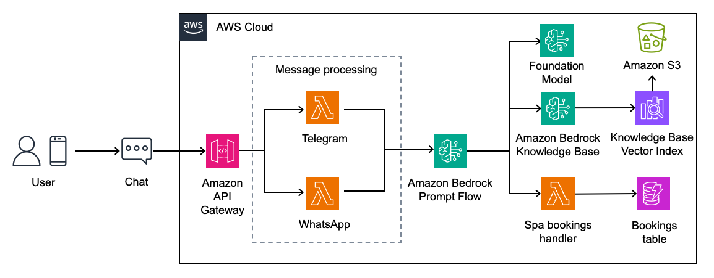
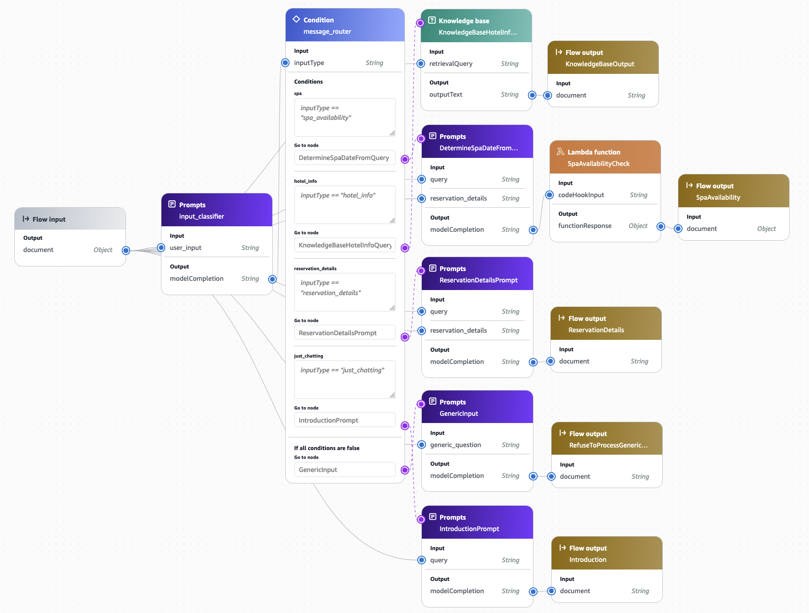
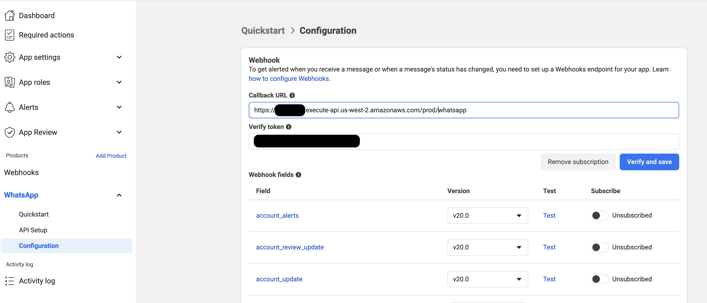

# Introduction

This repo implements a CDK stack that leverages CDK 
[L1](https://docs.aws.amazon.com/cdk/api/v2/docs/aws-cdk-lib.aws_bedrock.CfnAgent.html) 
[constructs](https://docs.aws.amazon.com/cdk/api/v2/docs/aws-cdk-lib.aws_bedrock.CfnKnowledgeBase.html) 
to create a Telegram Bot for handling GenAI-powered interactions with a hotel guest.

The code implements a Telegram bot that leverages [Webhooks](https://core.telegram.org/bots/api#setwebhook)
for compatibility with other messaging platforms to assist hotel customers with information regarding their stay
in a hotel.

The code is also a good example of how to create a Bedrock Agent completely with CDK that you can use as a
base for other implementations. 

# Architecture

The solution relies on two main components:
* An Amazon Bedrock agent powered by Anthropic Claude Haiku + Cohere Embed Multilingual for handling
  the conversations.
* An [API Gateway](https://aws.amazon.com/api-gateway/) powered by the lambda code defined in
  [`telegram_api`](lambda/telegram_api) & [`whatsapp_api`](lambda/whatsapp_api) that handles Telegram & WhatsApp Webhook requests and, 
  using the Bedrock Agent, answers the user's requests.

The diagram below describes the current architecture of the solution.



The assistant relies heavily in [Amazon Bedrock Prompt Flows](https://aws.amazon.com/bedrock/prompt-flows/), the 
definition for which is stored in [`flow_definition.json`](resources/flow_definition.json) and can be seen below:



# Requirements

* Python 3.12.
* [CDK](https://docs.aws.amazon.com/cdk/v2/guide/getting_started.html).
* [Docker](https://www.docker.com/) or [Podman](https://podman.io/) for compiling the container images.
* The requirements in [`requirements.txt`](requirements.txt) and in each individual lambda code folder.
* [A new Telegram bot](https://core.telegram.org/bots/tutorial); note its API key as provided by Botfather.
* [A WhatsApp app](https://developers.facebook.com/docs/whatsapp/cloud-api/get-started); note its Phone ID 
  in WhatsApp > API Setup from the app page in the Facebook developer portal.

# Setup

Make sure to deploy the stack in an AWS region where Amazon Bedrock with Anthropic Claude 3 Haiku & 
Amazon Titan Embed Text v2 and Bedrock Promp Flows are available.

Telegram API tokens are provided by Botfather and are permanent. WhatsApp makes a distinction between
development and permanent tokens. The following steps assume you have a development token, WhatsApp will 
only provide it to you once your WebHook is operational. To sort this out, we will be deploying the stack
twice:
* The first deployment will get the WebHook endpoint running with an intentionally invalid WhatsApp key. 
  This should be enough to be able to configure the WebHook in Meta's App Dashboard and retrieve the 
  Access Token. There is no impact from doing this since we won't actually be trying to send WhatsApp
  messages yet.
  At this point the Telegram bot should be fully operational.
* The second deployment will update the secret with the udated Access Token. You should also do this when
  the deployment token is updated. From this point on both the Telegram & WhatsApp bots should be fully
  operational. 

In the root folder of this repo, run:

```bash
# Optionally run the following if running in Podman, skip it if you're using Docker
# export CDK_DOCKER=podman
# Deploy providing the API key you got when creating the new Telegram bot. WHATSAPP_ID is the Phone ID you got before
cdk deploy --parameters TelegramAPIKey="${TELEGRAM_API_KEY}" --parameters WhatsAppPhoneID="${WHATSAPP_ID}" --parameters WhatsaAppAPIKey="INTENTIONALLY_INVALID_API_KEY"
# You can now get the WhatsAppAPIVerifyToken value, you will use it for setting up the WhatsApp WebHook
# You can also get it from AWS Secrets Manager
aws secretsmanager get-secret-value --secret-id WhatsAppAPIVerifyToken --query SecretString
```

At this point the telegram bot should be fully operational. We will now configure the 
[WhatsApp webhook](https://developers.facebook.com/docs/whatsapp/cloud-api/guides/set-up-webhooks).

Go to your application in the Facebook developer portal and in the left menu go to WhatsApp > Configuration;
use the value of `HotelAssistant.GenAIAssistantMessagingAPIEndpoint` from the CDK deployment `Outputs` section
and from the `WhatsAppAPIVerifyToken` secret that we read earlier and use them for configuring the WhatsApp
Webhook as shown in the following image.



You should now be able to generate an API key from the dashboard, as shown below:


```bash
# Deploy again with both correct API keys
cdk deploy --parameters TelegramAPIKey="${TELEGRAM_API_KEY}" --parameters WhatsAppPhoneID="${WHATSAPP_ID}" --parameters WhatsaAppAPIKey="${WHATSAPP_API_KEY}"
```

After that, the WhatsApp integration should be working. You can start a discussion as described [below](#whatsapp).

# Code structure

The code in this project is organized as follows:

* [`cdk`](cdk): CDK python code for deploying the infrastructure.
  - [`hotel_assistant.py`](cdk/hotel_assistant.py): Main CDK Stack code
  - [`aoss_kb_stack.py`](cdk/aoss_kb_stack.py): An opinionated, easy-to-use, CDK construct that creates
    the OpenSearch Serverless Collection, S3 deployment & Bedrock Knowledge Base, all using native
    CDK L1 constructs. The OpenSearch Serverless Collection Index is, however, created as a Custom resource in this
    stack with the code in the [`collections`](lambda/collections) lambda, since it cannot be created with CDK today.
  - [`messaging_backend.py`](cdk/messaging_backend.py): CDK construct for deploying the API gateway with Lambda
    integration for implementing the telegram webhook backend.
  - [`assistant_flow.py`](cdk/assistant_flow.py): Creates the Prompt Flow and an alias based on the definition in
    [`flow_definition.json`](resources/flow_definition.json).
  - [`reservations.py`](cdk/reservations.py): Deploys the resources for querying and creating new Spa bookings into
    a DynamoDB table.
* [`docs`](docs): Folder with documents that will be deployed to S3 when deploying the stack components in
  [`hotel_aoss_kb_stack.py`](cdk/aoss_kb_stack.py).
* [`lambda`](lambda): Lambda code. All lambdas are implemented in python with container runtimes.
  - [`collections`](lambda/collections): Lambda code implementing the
    [`CfnCustomResource`](https://docs.aws.amazon.com/cdk/api/v2/docs/aws-cdk-lib.CfnCustomResource.html) that
    creates the index in the OpenSearch Serverless Collection.
  - [`kb_sync`](lambda/kb_sync): Lambda code that will trigger a Knowledge Base sync every time that a file is
    added/removed from the S3 bucket created during deployment.
  - [`set_webhook`](lambda/set_webhook): Lambda code implementing the 
    [`CfnCustomResource`](https://docs.aws.amazon.com/cdk/api/v2/docs/aws-cdk-lib.CfnCustomResource.html) that
    sets the API Gateway-backed backend as the Webhook for the Telegram Bot. The WhatsApp Webhook must be configured
    manually as described [above](#setup).
  - [`telegram_api`](lambda/telegram_api): Lambda code for handling the Telegram Webhook requests.
  - [`whatsapp_api`](lambda/whatsapp_api): Lambda code for handling the WhatsApp Webhook requests.
  - [`reservations`](lambda/reservations): Lambda code for handling the Spa reservations in DynamoDB.
* [`resources`](resources): Folder with Flow definition resources.
* [`app.py`](app.py): Main entrypoint for the code. Won't typically be executed directly but with `cdk` as
  described in the [setup](#setup) section.

# Using the Assistant

The user experience should be simmilar in both Telegram & WhatsApp, with the main difference being that in Telegram
it must be the user who initiates the conversation with the bot, whereas in WhatsApp companies can directly message
customers.

## Telegram

Use the Telegram application to search for your bot and start a conversation with them.


## WhatsApp

In the case of the WhatsApp bot, it is the bot who should initiate the conversation. If your application is in
development status you will only be able to write to registered phone numbers.

As a convenience, the API deployed by this solution implements a POST endpoint that you can use to start a new dummy
conversation. You do that by sending a POST request to the endpoint provided by `cdk` as an output 
(search for `HotelAssistant.GenAIAssistantMessagingAPIEndpoint`).

Please, be advised that this endpoint is not protected. For development/demo purposes this might be fine since 
WhatsApp will only allow you to start a conversation with registered phone numbers but is by no means an 
acceptable practice for a production system.

```bash
curl -X POST "${API_ENDPOINT}/whatsapp" \
     -d '{ "object":"new_conversation_request", "recipient_id":"${RECIPIENT_WHATSAPP_ID}", "recipient_name":"${RECIPIENT_NAME}"}'

# Example
# curl -X POST "https://aaaaaaaaaa.execute-api.us-west-2.amazonaws.com/prod/whatsapp" \
#      -d '{ "object":"new_conversation_request", "recipient_id":"346111111111", "recipient_name":"Joseba"}'
```

The animation below shows an example interaction with the Assistant, where a user is sent the details of their
reservation through a backend-initiated conversation and can then go on to interact with the assistant and even
book a Spa session directly from WhatsApp, which is recorded in a DynamoDB table.


# References

[This project](https://github.com/build-on-aws/building-gen-ai-whatsapp-assistant-with-amazon-bedrock-and-python)
exposes LangChain agents using Whatsapp. It provides more chat-related functionality, while this project provides more
thorough infrastructure as code foundation. Go check it out!

# Appendix

This code interacts with Telegram Bot API which has terms published at https://telegram.org/tos/bot-developers.
You should confirm that your use case complies with the terms before proceeding. It also interacts with the WhatsApp
API, which you must agree to when creating your Application in Meta's Developer portal.
